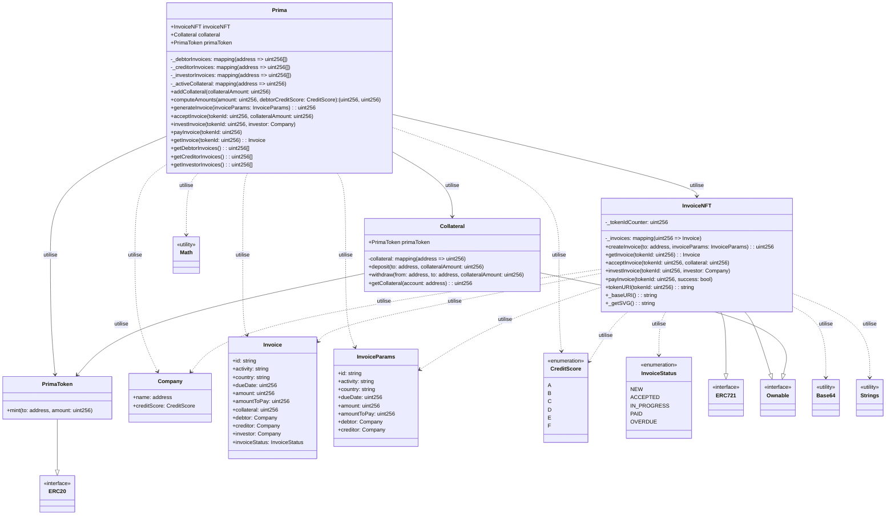

# Architecture du Projet Prima

## Diagramme UML des Smart Contracts

## Description des Contrats

### Prima (Contrat Principal)
- Gère l'ensemble du système de financement de factures
- Coordonne les interactions entre les différents contrats
- Implémente la logique métier principale
- Stocke les mappings des factures par type d'utilisateur (débiteur, créancier, investisseur)
- Gère les garanties actives des débiteurs

### InvoiceNFT
- Gère les factures sous forme de NFTs (ERC721)
- Stocke les métadonnées des factures
- Gère les états des factures (NEW, ACCEPTED, IN_PROGRESS, PAID, OVERDUE)
- Implémente les fonctions de création, acceptation, investissement et paiement des factures
- Génère les métadonnées on-chain pour les NFTs

### Collateral
- Gère les garanties des débiteurs
- Permet le dépôt et le retrait des garanties
- Utilise le PrimaToken pour les transactions
- Vérifie les soldes suffisants avant les retraits

### PrimaToken
- Token ERC20 standard pour les transactions
- Utilisé pour les paiements et les garanties
- Permet le mint de nouveaux tokens

## Structures et Enums

### Company
- Structure représentant une entreprise
- Contient l'adresse et le score de crédit

### Invoice
- Structure complète d'une facture
- Contient toutes les informations nécessaires pour le financement

### InvoiceParams
- Structure pour la création d'une facture
- Contient les paramètres initiaux sans les informations d'investissement

### CreditScore
- Enumération des scores de crédit (A à F)
- Utilisé pour calculer les montants minimum et maximum des factures

### InvoiceStatus
- Enumération des états possibles d'une facture
- Trace le cycle de vie complet d'une facture

## Dépendances OpenZeppelin

### Contrats Standards
- ERC721 : Pour la gestion des NFTs (factures)
- ERC20 : Pour le token Prima
- Ownable : Pour la gestion des permissions

### Utilitaires
- Math : Pour les calculs de montants
- Base64 : Pour l'encodage des métadonnées
- Strings : Pour la manipulation des chaînes

## Flux d'Utilisation

1. **Création d'une Facture**
   - Le créancier crée une facture via Prima
   - La facture est mintée comme NFT
   - Le débiteur peut accepter la facture

2. **Gestion des Garanties**
   - Le débiteur dépose des garanties
   - Les garanties sont verrouillées pour la facture
   - Les garanties peuvent être utilisées en cas de défaut de paiement

3. **Investissement**
   - Un investisseur peut investir dans une facture
   - Le montant est transféré au créancier
   - L'investisseur devient propriétaire du NFT

4. **Paiement**
   - Le débiteur paie la facture
   - En cas de défaut, les garanties sont utilisées
   - Le NFT est marqué comme payé

## Sécurité

- Tous les contrats héritent des standards OpenZeppelin
- Les permissions sont gérées via Ownable
- Les calculs utilisent Math pour éviter les débordements
- Les transferts de tokens sont sécurisés via les standards ERC20/ERC721 